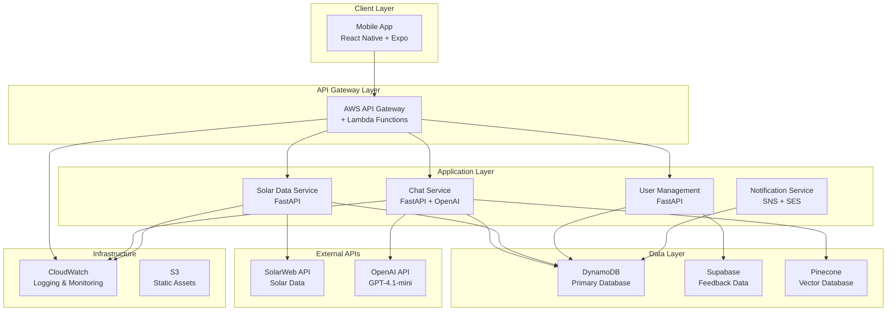

# System Architecture

## Overview

The Solar Operations & Maintenance (O&M) Platform is a cloud-native application designed to monitor, manage, and optimize solar installations. The system provides real-time monitoring, AI-powered assistance, and comprehensive incident management capabilities.

## High-Level Architecture



## Component Details

### Mobile Application (React Native + Expo)

**Technology Stack:**
- React Native 0.76.9
- Expo SDK 52.0.46
- TypeScript
- React Native Paper (UI Components)
- AWS Amplify (Authentication)

**Key Features:**
- Real-time solar system monitoring dashboard
- AI-powered chat assistant with RAG capabilities
- Interactive maps with system locations
- Push notifications for system alerts
- Incident reporting and management
- Offline capability with local storage

**Authentication Flow:**
- AWS Cognito integration for user management
- JWT tokens for API authentication
- Secure storage using Expo SecureStore
- Role-based access control (admin/user)

### Backend Services (AWS Lambda + FastAPI)

#### 1. Chat Service (`chat_service_lambda.py`)
**Purpose:** AI-powered conversational interface for solar O&M operations

**Key Features:**
- RAG (Retrieval Augmented Generation) implementation
- OpenAI GPT-4.1-mini integration
- Pinecone vector database for knowledge retrieval
- Conversation memory and context management
- Function calling for data retrieval

**API Endpoints:**
- `POST /api/chat` - Process chat messages
- `GET /health` - Health check

#### 2. Solar Data Service (`solar_data_lambda.py`)
**Purpose:** Fetch, process, and serve solar system performance data

**Key Features:**
- SolarWeb API integration
- Real-time and historical data processing
- System status calculation (green/red/moon phases)
- Energy production and earnings calculations
- CO2 savings computations

**API Endpoints:**
- `GET /api/systems/{system_id}/consolidated-daily`
- `GET /api/systems/{system_id}/consolidated-weekly`
- `GET /api/systems/{system_id}/consolidated-monthly`
- `GET /api/systems/{system_id}/profile`
- `GET /api/systems/{system_id}/status`
- `GET /api/inverters/{inverter_id}/profile`

#### 3. User Management Service (`user_management_lambda.py`)
**Purpose:** Handle user profiles, system access, and device management

**Key Features:**
- User profile management
- System access control
- Device registration for push notifications
- Incident tracking and management

**API Endpoints:**
- `GET /api/user/{user_id}/profile`
- `GET /api/user/{user_id}/systems`
- `POST /api/device/register`
- `GET /api/user/{user_id}/incidents`

#### 4. Technician Response Service (`technician_response.py`)
**Purpose:** Handle technician communications and incident responses

**Key Features:**
- Google Forms integration for technician responses
- Email notifications via AWS SES
- Incident status updates

### Data Architecture

#### Primary Database: AWS DynamoDB

**Table Structure: `Moose-DDB`**

**Design Pattern:** Single-table design with composite keys

**Key Patterns:**
```
PK: System#{system_id}        SK: STATUS
PK: System#{system_id}        SK: PROFILE  
PK: System#{system_id}        SK: DAILY#{date}
PK: System#{system_id}        SK: WEEKLY#{week}
PK: System#{system_id}        SK: MONTHLY#{month}
PK: User#{user_id}           SK: PROFILE
PK: User#{user_id}           SK: SYSTEMS
PK: Device#{device_id}       SK: PROFILE
PK: CHAT#{user_id}          SK: CONVERSATION#{timestamp}
PK: Incident#{incident_id}   SK: DETAILS
```

**Data Types Stored:**
- Solar system profiles and metadata
- Real-time and historical performance data
- User profiles and system access mappings
- Device registrations for notifications
- Chat conversation logs
- Incident reports and technician responses

#### Secondary Database: Supabase (Legacy)

**Purpose:** Feedback and support ticket management

**Schema:**
```sql
CREATE TABLE feedback (
  id UUID PRIMARY KEY,
  ticket_id TEXT UNIQUE,
  name TEXT,
  email TEXT,
  message TEXT,
  timestamp BIGINT,
  status TEXT CHECK (status IN ('pending', 'resolved')),
  created_at TIMESTAMPTZ DEFAULT now()
);
```

#### Vector Database: Pinecone

**Purpose:** Knowledge base for AI chat functionality

**Configuration:**
- Index Name: `moose-om`
- Embedding Model: OpenAI text-embedding-3-large
- Dimensions: 3072
- Metric: Cosine similarity

**Content Types:**
- Solar system documentation
- Troubleshooting guides
- Technical specifications
- Historical incident resolutions

### External Integrations

#### SolarWeb API
**Purpose:** Fetch real-time and historical solar system data

**Authentication:** Access Key ID + Access Key Value + JWT tokens

**Key Endpoints:**
- System profiles and metadata
- Real-time production data
- Historical energy data
- Inverter-level information
- System status and alerts

#### OpenAI API
**Purpose:** Power the AI chat assistant

**Configuration:**
- Model: gpt-4.1-mini
- Temperature: 0.0 (deterministic responses)
- Function calling enabled for data retrieval

### Status Calculation Logic

The system uses a sophisticated status calculation algorithm:

**Green Status:**
- Production during daytime hours
- All inverters operational
- No critical alerts

**Red Status:**
- No production during expected daytime hours
- Critical system failures
- Multiple inverter failures

**Moon Phase:**
- Nighttime hours (post-sunset to pre-sunrise)
- Green systems transition to moon phase
- Red systems remain red throughout night

### Notification System

**Architecture:**
- AWS SNS for message routing
- Expo Push Notifications for mobile alerts
- AWS SES for email communications

**Notification Types:**
1. **System Status Changes:** Green ↔ Red transitions
2. **Daily Production Reports:** Scheduled summaries
3. **Critical Alerts:** Immediate notifications for failures
4. **Technician Updates:** Incident response communications

### Monitoring and Observability

**CloudWatch Integration:**
- Lambda function metrics and logs
- Custom metrics for system performance
- Error tracking and alerting (planned)

**Logging Strategy:**
- Structured logging with correlation IDs
- Different log levels (INFO, WARN, ERROR)
- Conversation and API call logging

### Security Considerations

**Authentication & Authorization:**
- AWS Cognito for user authentication
- JWT tokens for API access
- Role-based access control

**Data Security:**
- Environment variables for secrets (moving to AWS Secrets Manager)
- HTTPS/TLS encryption for all communications
- Row-level security in Supabase

**API Security:**
- CORS configuration for web access
- Input validation using Pydantic models
- Rate limiting (planned)

### Deployment Architecture

**Current State:** Manual deployment
**Planned:** Automated CI/CD pipeline

**Lambda Deployment:**
- Docker containers using AWS Lambda base images
- Environment-specific configurations
- Blue/green deployment strategy (planned)

**Mobile App Deployment:**
- Expo Application Services (EAS)
- Over-the-air updates capability
- Platform-specific builds (iOS/Android)

### Performance Considerations

**Backend Optimization:**
- Lambda cold start mitigation
- DynamoDB connection pooling (50 connections)
- Caching strategies for frequently accessed data

**Mobile App Optimization:**
- Lazy loading for heavy components
- Local caching with AsyncStorage
- Background fetch for data updates

### Scalability Design

**Horizontal Scaling:**
- Serverless Lambda functions auto-scale
- DynamoDB on-demand pricing model
- Stateless service design

**Data Partitioning:**
- Time-based partitioning for historical data
- User-based partitioning for access patterns
- Geographic partitioning (future consideration)

## Technology Decisions

### Why AWS Lambda?
- **Serverless Benefits:** No infrastructure management, automatic scaling
- **Cost Efficiency:** Pay-per-request model suitable for variable loads
- **Integration:** Native AWS service integration (DynamoDB, SNS, CloudWatch)

### Why DynamoDB?
- **Performance:** Single-digit millisecond latency
- **Scalability:** Handles variable workloads automatically  
- **Cost:** On-demand pricing aligns with usage patterns
- **Integration:** Native Lambda integration

### Why React Native + Expo?
- **Cross-Platform:** Single codebase for iOS and Android
- **Developer Experience:** Hot reloading, easy debugging
- **Over-the-Air Updates:** Quick bug fixes and feature deployment
- **Community:** Large ecosystem and community support

### Why Separate Lambda Functions?
- **Separation of Concerns:** Each service has distinct responsibilities
- **Independent Scaling:** Services scale based on individual usage
- **Deployment Flexibility:** Deploy and update services independently
- **Error Isolation:** Failures in one service don't affect others

This architecture provides a robust, scalable foundation for the Solar O&M Platform while maintaining flexibility for future enhancements and integrations.
