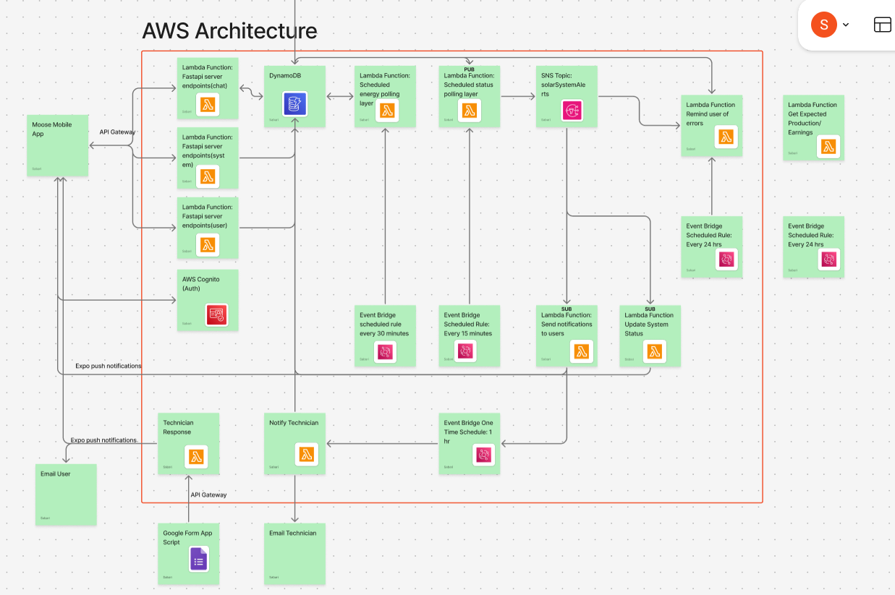
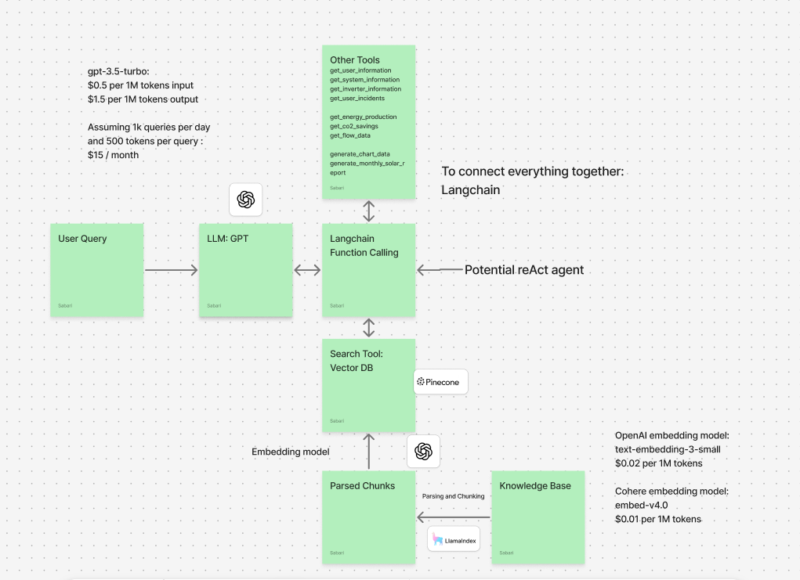

# System Architecture

## Overview

The Solar Operations & Maintenance (O&M) Platform is a cloud-native application designed to monitor, manage, and optimize solar installations. The system provides real-time monitoring, AI-powered assistance, and comprehensive incident management capabilities.

## High-Level Architecture



## Chatbot Pipeline


## Component Details

### Mobile Application (React Native + Expo)

**Technology Stack:**
- React Native 0.76.9
- Expo SDK 52.0.46
- TypeScript


**Key Features:**
- Real-time solar system monitoring dashboard
- AI-powered chat assistant with RAG capabilities
- Interactive maps with system locations
- Push notifications for system alerts
- Incident reporting and management
- Offline capability with local storage

**Authentication Flow:**
- AWS Cognito integration for user management
- JWT tokens for API authentication
- Secure storage using Expo SecureStore
- Role-based access control (admin/user)

### Backend Services (AWS Lambda + FastAPI)

#### 1. Chat Service (`chat_service_lambda.py`)
**Purpose:** AI-powered conversational interface for solar O&M operations

**Key Features:**
- RAG (Retrieval Augmented Generation) implementation
- OpenAI GPT-4.1-mini integration
- Pinecone vector database for knowledge retrieval
- Conversation memory and context management
- Function calling for data retrieval

**API Endpoints:**
- `POST /api/chat` - Process chat messages
- `GET /health` - Health check

#### 2. Solar Data Service (`solar_data_lambda.py`)
**Purpose:** Fetch, process, and serve solar system performance data

**Key Features:**
- Includes API Endpoints for any System related queries
- Energy production and earnings 
- CO2 savings 
- System/Inverter Profile Information

**API Endpoints:**
- `GET /api/systems/{system_id}/consolidated-daily`
- `GET /api/systems/{system_id}/consolidated-weekly`
- `GET /api/systems/{system_id}/consolidated-monthly`
- `GET /api/systems/{system_id}/profile`
- `GET /api/systems/{system_id}/status`
- `GET /api/inverters/{inverter_id}/profile`

#### 3. User Management Service (`user_management_lambda.py`)
**Purpose:** Handle user profiles, system access, and device management

**Key Features:**
- User profile management
- System access control
- Device registration for push notifications
- Incident tracking and management

**API Endpoints:**
- `GET /api/user/{user_id}/profile`
- `GET /api/user/{user_id}/systems`
- `POST /api/device/register`
- `GET /api/user/{user_id}/incidents`

#### 4. Technician Response Service (`technician_response.py`)
**Purpose:** Handle technician communications and incident responses

**Key Features:**
- Google Forms integration for technician responses
- Email notifications via AWS SES
- Push notifications to users
- Incident status updates

##### 5. System Data Polling (`polling.py`)
**Purpose:** Collect comprehensive solar system performance data from SolarWeb API

**Key Features:**
- Polls SolarWeb API for all PV systems and inverters
- Stores daily, weekly, monthly, and yearly aggregated data
- Batch processing with rate limiting (8 systems per batch, 3-second delays)
- Concurrent processing with thread pooling
- Comprehensive error handling and retry logic

**Data Collection:**
- Daily: Aggregated data + flow data (2 API calls per system)
- Weekly/Monthly/Yearly: Aggregated data only (1 API call per system)
- Inverter-level daily data collection
- Earnings rate calculations using system-specific rates

**Scheduling:** Runs every 30 minutes via EventBridge Scheduler

##### 6 Device Status Polling (`device_status_polling.py`)
**Purpose:** Monitor real-time status of individual solar inverters

**Key Features:**
- Monitors individual inverters production
- Real-time power output and error condition monitoring
- Intelligent status logic based on time of day and moon periods
- SNS notifications for status changes only

**Status Logic:**
- **Green:** Power > 0 during daylight hours, no critical errors
- **Red:** Power = 0 during expected daylight hours
- **Moon:** Nighttime hours (sunset-1h to sunrise+1h)

**Scheduling:** Runs every 15 minutes via EventBridge Scheduler

#### 7. Notification Services

##### 7.1 User Notifications (`notify_user.py`)
**Purpose:** Send push notifications to users for system status changes

**Key Features:**
- Processes SNS messages from device status polling
- Identifies users with system access permissions
- Batch sends Expo push notifications
- Creates incident records for red status changes
- Schedules technician notifications (1-hour delay)

**Notification Flow:**
1. Receives SNS message with status change
2. Queries users with system access
3. Retrieves user device tokens
4. Sends batch push notifications via Expo
5. Creates incident record if status is red
6. Schedules technician notification

##### 7.2 Technician Notifications (`notify_technician.py`)
**Purpose:** Send email notifications to technicians for unresolved incidents

**Key Features:**
- Triggered by EventBridge scheduler (1 hour after incident)
- Checks incident status before sending
- Sends detailed email via AWS SES
- Includes system information and incident details
- Cleans up scheduled tasks after processing

**Email Content:**
- Incident details and timestamps
- System location and specifications
- Direct links to system monitoring
- Contact information for user

##### 8 Red Code Reminders (`red_code_reminder.py`)
**Purpose:** Daily reminders for systems in prolonged red status

**Key Features:**
- Scans all inverters for red status > 15 hours
- Sends SNS notifications for persistent issues
- Concurrent processing for efficiency
- Daily scheduling via EventBridge Scheduler

**Logic:**
- Queries all inverter status records
- Filters for red status > 15 hours old
- Sends "Daily Reminder" SNS messages
- Processes up to 10 inverters concurrently

##### 9 System Status Updates (`update_status.py`)
**Purpose:** Aggregate individual device statuses into system-level status

**Key Features:**
- Subscribes to SNS notifications from device polling
- Calculates system status from individual inverter statuses
- Updates DynamoDB only when status changes
- Historical status logging with timezone support

**Status Aggregation Logic:**
- **Red System:** Any inverter is red
- **Moon System:** All inverters are moon phase
- **Green System:** All inverters are green

##### 10. Automatic Reports (`automatic_report.py`)
**Purpose:** Send monthly performance reports via SMS

**Key Features:**
- Queries users with phone numbers
- Aggregates monthly system performance data
- Calculates KPIs (production, earnings, CO2 savings)
- Sends formatted SMS reports via SNS

**Report Content:**
- Monthly energy production (kWh)
- Earnings calculations
- CO2 savings impact
- System-by-system breakdown
- Aggregated portfolio performance

### Data Architecture

#### Primary Database: AWS DynamoDB

**Table Structure: `Moose-DDB`**

**Design Pattern:** Single-table design with composite keys

**Key Patterns:**
```
PK: System#{system_id}        SK: STATUS
PK: System#{system_id}        SK: PROFILE  
PK: System#{system_id}        SK: DATA#DAILY#{date}
PK: System#{system_id}        SK: DATA#WEEKLY#{week}
PK: System#{system_id}        SK: DATA#MONTHLY#{month}
PK: Inverter#{inverter_id}        SK: STATUS
PK: Inverter#{inverter_id}        SK: PROFILE  
PK: Inverter#{inverter_id}        SK: DATA#DAILY#{date}
PK: Inverter#{inverter_id}        SK: DATA#WEEKLY#{week}
PK: Inverter#{inverter}        SK: DATA#MONTHLY#{month}
PK: User#{user_id}           SK: PROFILE
PK: User#{user_id}           SK: SYSTEM#{SystemId}
PK: Device#{device_id}       SK: PROFILE
PK: CHAT#{user_id}          SK: CONVERSATION#{timestamp}
PK: Incident#{incident_id}   SK: DETAILS
```

**Data Types Stored:**
- Solar system profiles and metadata
- Real-time and historical performance data
- User profiles and system access mappings
- Device registrations for notifications
- Chat conversation logs
- Incident reports and technician responses

#### Secondary Database: Supabase (Legacy)

**Purpose:** Feedback and support ticket management

**Schema:**
```sql
CREATE TABLE feedback (
  id UUID PRIMARY KEY,
  ticket_id TEXT UNIQUE,
  name TEXT,
  email TEXT,
  message TEXT,
  timestamp BIGINT,
  status TEXT CHECK (status IN ('pending', 'resolved')),
  created_at TIMESTAMPTZ DEFAULT now()
);
```

#### Vector Database: Pinecone

**Purpose:** Knowledge base for AI chat functionality

**Configuration:**
- Index Name: `moose-om`
- Embedding Model: OpenAI text-embedding-3-large
- Dimensions: 3072
- Metric: Cosine similarity

**Content Types:**
- Solar system documentation
- Troubleshooting guides
- Technical specifications
- Historical incident resolutions

### External Integrations

#### SolarWeb API
**Purpose:** Fetch real-time and historical solar system data

**Authentication:** Access Key ID + Access Key Value + JWT tokens

**Key Endpoints:**
- System profiles and metadata
- Real-time production data
- Historical energy data
- Inverter-level information
- System status and alerts

#### OpenAI API
**Purpose:** Power the AI chat assistant

**Configuration:**
- Model: gpt-4.1-mini
- Temperature: 0.0 (deterministic responses)
- Function calling enabled for data retrieval

### Status Calculation Logic

The system uses a sophisticated status calculation algorithm:

**Green Status:**
- Production during daytime hours
- All inverters operational
- No critical alerts

**Red Status:**
- No production during expected daytime hours
- Critical system failures
- Multiple inverter failures

**Moon Phase:**
- Nighttime hours (post-sunset to pre-sunrise)
- Green systems transition to moon phase
- Red systems remain red throughout night

### Notification System

**Architecture:**
- AWS SNS for message routing
- Expo Push Notifications for mobile alerts
- AWS SES for email communications

**Notification Types:**
1. **System Status Changes:** Green ↔ Red transitions
2. **Daily Production Reports:** Scheduled summaries
3. **Critical Alerts:** Immediate notifications for failures
4. **Technician Updates:** Incident response communications

### Monitoring and Observability

**CloudWatch Integration:**
- Lambda function metrics and logs
- Custom metrics for system performance
- Error tracking and alerting (planned)


### Security Considerations

**Authentication & Authorization:**
- AWS Cognito for user authentication
- JWT tokens for API access
- Role-based access control

**Data Security:**
- Environment variables for secrets (moving to AWS Secrets Manager)
- HTTPS/TLS encryption for all communications
- Row-level security in Supabase

**API Security:**
- Input validation using Pydantic models
- Rate limiting (planned)

### Deployment Architecture

**Current State:** Manual deployment
**Planned:** Automated CI/CD pipeline

**Lambda Deployment:**
- Docker containers using AWS Lambda base images
- Environment-specific configurations
- Blue/green deployment strategy (planned)

**Mobile App Deployment:**
- Expo Application Services (EAS)
- Over-the-air updates capability
- Platform-specific builds (iOS/Android)

### Performance Considerations

**Backend Optimization:**
- Lambda cold start mitigation
- DynamoDB connection pooling (50 connections)
- Caching strategies for frequently accessed data


### Scalability Design

**Horizontal Scaling:**
- Serverless Lambda functions auto-scale
- DynamoDB on-demand pricing model
- Stateless service design

**Data Partitioning:**
- Time-based partitioning for historical data
- User-based partitioning for access patterns
- Geographic partitioning (future consideration)

## Technology Decisions

### Why AWS Lambda?
- **Serverless Benefits:** No infrastructure management, automatic scaling
- **Cost Efficiency:** Pay-per-request model suitable for variable loads
- **Integration:** Native AWS service integration (DynamoDB, SNS, CloudWatch)

### Why DynamoDB?
- **Performance:** Single-digit millisecond latency
- **Scalability:** Handles variable workloads automatically  
- **Cost:** On-demand pricing aligns with usage patterns
- **Integration:** Native Lambda integration

### Why React Native + Expo?
- **Cross-Platform:** Single codebase for iOS and Android
- **Developer Experience:** Hot reloading, easy debugging
- **Over-the-Air Updates:** Quick bug fixes and feature deployment
- **Community:** Large ecosystem and community support

### Why Separate Lambda Functions?
- **Separation of Concerns:** Each service has distinct responsibilities
- **Independent Scaling:** Services scale based on individual usage
- **Deployment Flexibility:** Deploy and update services independently
- **Error Isolation:** Failures in one service don't affect others


